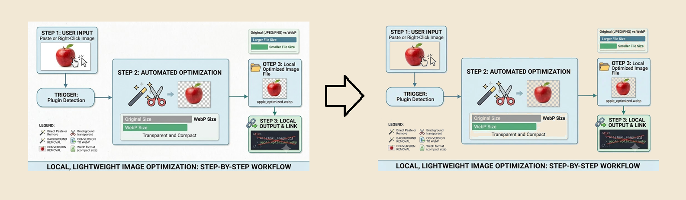

# Illuminator

> **Language** [🇺🇸 English](#-english) | [🇨🇳 简体中文](#-简体中文) | [🇩🇪 Deutsch](#-deutsch)

---

## 🇺🇸 English

A local, lightweight plugin to make white backgrounds transparent, convert into compact WebP format and automatically update link when you directly paste an image or right-click it in the file panel.

### 💡 Best Use Case
* **Optimized for Light Mode:** Perfect for users who use Light Mode with custom background colors (Sepia, Grey, etc.).
* **Note:** Since this removes the white background, pure black text will become harder to see if viewed in Obsidian's Dark Mode.

### 🛠 How it Works
* **RGB Thresholding:** Pixels brighter than your chosen setting are converted to 100% transparency.
* **100% Local:** All processing happens in a Web Worker on your machine. No data ever leaves your vault.
* **⚠️ Permanent Change:** This process modifies the image data. Please keep backups of your original images if needed.

---

## 🇨🇳 简体中文

一个本地、轻量的插件。当你直接粘贴图片或在文件面板中右键点击图片时，它可以将白色背景转为透明, 转换为更小体积的 WebP 格式, 并自动更新笔记链接。

### 💡 最佳使用场景
* **浅色模式优化：** 非常适合在浅色模式下使用自定义背景色（如米黄、淡绿等）的用户。
* **注意：** 由于去除了白色背景，如果切换到 Obsidian 的暗黑模式，图片中的纯黑色文字会变得难以看清。

### 🛠 工作原理
* **RGB 阈值：** 亮度高于设定值的像素将被转换为 100% 透明。
* **100% 本地化：** 所有处理均在本地 Web Worker 中完成。数据永远不会离开你的文件夹。
* **⚠️ 永久修改：** 此操作会修改图像数据且不可逆，如有需要请提前备份原始图片。

---

## 🇩🇪 Deutsch

Ein lokales, leichtgewichtiges Plugin, um weiße Hintergründe transparent zu machen, Bilder in kompaktes WebP-Format umzuwandeln und Bildlinks automatisch zu aktualisieren, wenn du ein Bild einfügst oder im Datei-Panel rechtsklickst.

### 💡 Beste Anwendung
* **Optimiert für den Light Mode:** Perfekt für Nutzer, die den Light Mode mit benutzerdefinierten Hintergrundfarben verwenden.
* **Hinweis:** Da der weiße Hintergrund entfernt wird, kann rein schwarzer Text im Dark Mode von Obsidian schwer lesbar werden.

### 🛠 Funktionsweise
* **RGB-Schwellenwert:** Pixel, die heller als der gewählte Wert sind, werden zu 100% transparent.
* **100% Lokal:** Die Verarbeitung erfolgt vollständig in einem Web Worker auf deinem Rechner.
* **⚠️ Permanente Änderung:** Dieser Vorgang verändert die Bilddaten dauerhaft. Bitte bei Bedarf Backups der Originalbilder aufbewahren.

---

*Created with the assistance of AI to solve a problem that was bothering me.*